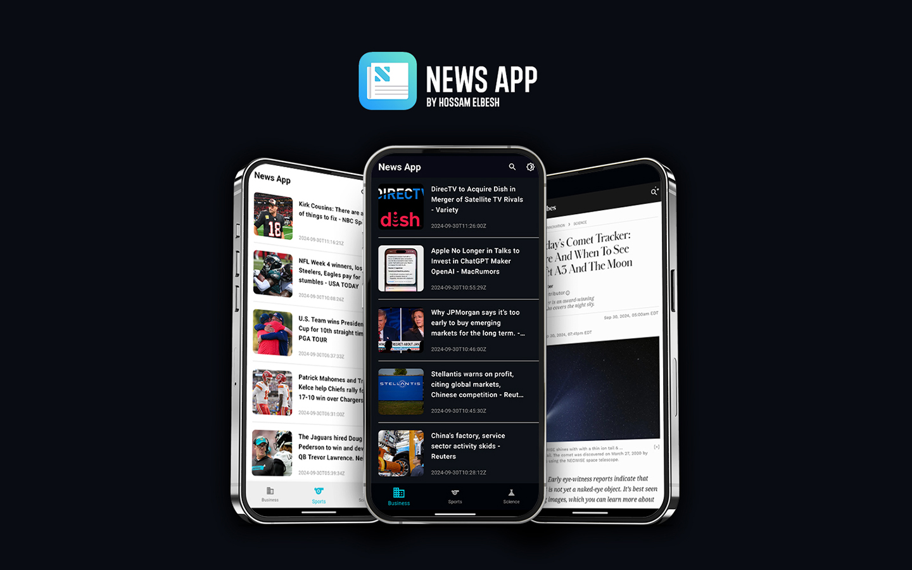

# News Application

A Flutter-based news application that provides the latest news updates across multiple categories like Business, Sports, and Science. This app utilizes the BLoC pattern for state management and integrates with the News API to fetch real-time news data.

## Features

- **Dark/Light Mode Toggle:** Switch between light and dark themes.
- **Category-wise News:** Browse news in different categories like Business, Sports, and Science.
- **Search Functionality:** Search for news articles based on keywords.
- **Real-time Data Fetching:** News fetched from the [News API](https://newsapi.org/) in real-time.
- **Responsive UI:** Optimized for both Android and iOS devices.
- **BLoC Architecture:** Implements the BLoC pattern for effective state management.

## Technologies Used

- **Flutter:** A UI toolkit to build natively compiled applications for mobile, web, and desktop from a single codebase.
- **Dart:** The programming language used for building the application.
- **BLoC (Business Logic Component):** A state management library to separate business logic from UI.
- **Dio:** A powerful HTTP client used for making API requests.
- **News API:** A REST API to retrieve the latest news articles.
- **Shared Preferences:** Used for persisting user settings like theme preferences.
- **WebView:** To open full news articles within the app.

## Getting Started

This project is a starting point for a Flutter application.

A few resources to get you started if this is your first Flutter project:

- [Lab: Write your first Flutter app](https://docs.flutter.dev/get-started/codelab)
- [Cookbook: Useful Flutter samples](https://docs.flutter.dev/cookbook)
- API Key from [News API](https://newsapi.org/)

For help getting started with Flutter development, view the
[online documentation](https://docs.flutter.dev/), which offers tutorials,
samples, guidance on mobile development, and a full API reference.
